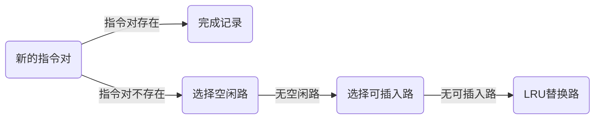
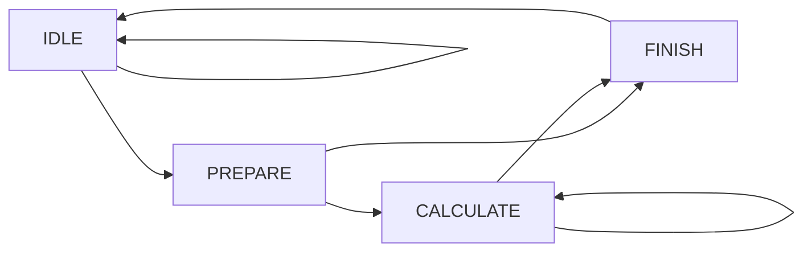
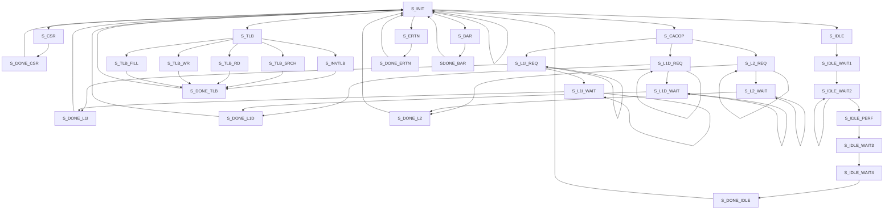
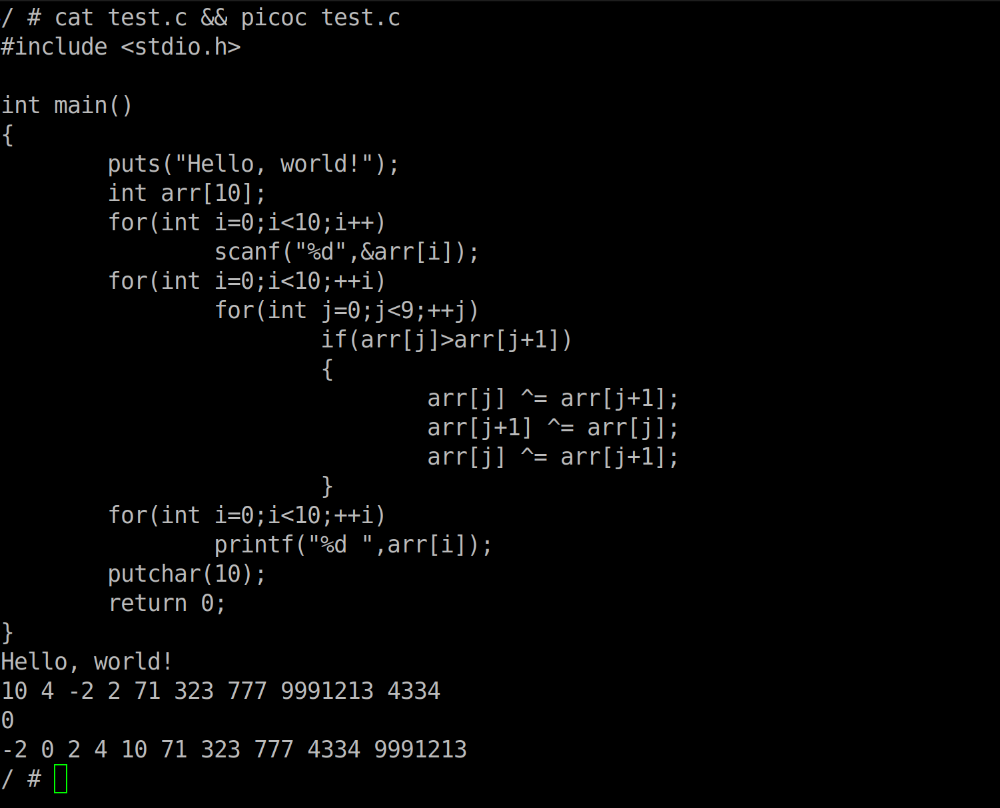

# NSCSCC2022 LoongArch挑战赛

中国科学技术大学 小步快跑队 2022年8月

## 成员

乐亦康、张子辰、郭耸霄、马子睿 （Unicode codepoint order）


## 设计简介

我们设计的 CPU 采用顺序双发射八级流水，实现了 67 条指令、26 种 CSR 寄存器、16 种例外[^0]。采用 AXI-4 总线。使用 4 路组相联 16KB icache 和 4 路组相联 16KB dcache，采用写回、按写分配的设计。使用分支预测器以减少分支失败带来的性能损失。使用 32 路全相连 TLB 加速地址转换。

### 指令列表

| 指令名称  |  ISA 指令类型  | 微结构指令类型 |
| :-------: | :------------: | :------------: |
| RDCNTID.W |  其他杂项指令  |      ALU       |
| RDCNTVL.W |  其他杂项指令  |      ALU       |
| RDCNTVH.W |  其他杂项指令  |      ALU       |
|   ADD.W   | 算术运算类指令 |      ALU       |
|   SUB.W   | 算术运算类指令 |      ALU       |
|    SLT    | 算术运算类指令 |      ALU       |
|   SLTU    | 算术运算类指令 |      ALU       |
|    NOR    | 算术运算类指令 |      ALU       |
|    AND    | 算术运算类指令 |      ALU       |
|    OR     | 算术运算类指令 |      ALU       |
|    XOR    | 算术运算类指令 |      ALU       |
|   SLL.W   | 移位运算类指令 |      ALU       |
|   SRL.W   | 移位运算类指令 |      ALU       |
|   SRA.W   | 移位运算类指令 |      ALU       |
|   MUL.W   | 算术运算类指令 |      MUL       |
|  MULH.W   | 算术运算类指令 |      MUL       |
|  MULH.WU  | 算术运算类指令 |      MUL       |
|   DIV.W   | 算术运算类指令 |      DIV       |
|   MOD.W   | 算术运算类指令 |      DIV       |
|  DIV.WU   | 算术运算类指令 |      DIV       |
|  MOD.WU   | 算术运算类指令 |      DIV       |
|   BREAK   |  其他杂项指令  |       —        |
|  SYSCALL  |  其他杂项指令  |       —        |
|  SLLI.W   | 移位运算类指令 |      ALU       |
|  SRLI.W   | 移位运算类指令 |      ALU       |
|  SRAI.W   | 移位运算类指令 |      ALU       |
|   SLTI    | 算术运算类指令 |      ALU       |
|   SLTUI   | 算术运算类指令 |      ALU       |
|  ADDI.W   | 算术运算类指令 |      ALU       |
|   ANDI    | 算术运算类指令 |      ALU       |
|    ORI    | 算术运算类指令 |      ALU       |
|   XORI    | 算术运算类指令 |      ALU       |
|   CSRRD   |  CSR 访问指令  |      CSR       |
|   CSRWR   |  CSR 访问指令  |      CSR       |
|  CSRXCHG  |  CSR 访问指令  |      CSR       |
|   CACOP   | Cache 维护指令 |     CACHE      |
|  TLBSRCH  |  TLB 维护指令  |      TLB       |
|   TLBRD   |  TLB 维护指令  |      TLB       |
|   TLBWR   |  TLB 维护指令  |      TLB       |
|  TLBFILL  |  TLB 维护指令  |      TLB       |
|   ERTN    |  其他杂项指令  |      ERET      |
|   IDLE    |  其他杂项指令  |      IDLE      |
|  INVTLB   |  TLB 维护指令  |      TLB       |
|  LU12I.W  | 算术运算类指令 |      ALU       |
| PCADDU12I | 算术运算类指令 |      ALU       |
|   LL.W    |  原子访存指令  |      MEM       |
|   SC.W    |  原子访存指令  |      MEM       |
|   LD.B    |  普通访存指令  |      MEM       |
|   LD.H    |  普通访存指令  |      MEM       |
|   LD.W    |  普通访存指令  |      MEM       |
|   ST.B    |  普通访存指令  |      MEM       |
|   ST.H    |  普通访存指令  |      MEM       |
|   ST.W    |  普通访存指令  |      MEM       |
|   LD.BU   |  普通访存指令  |      MEM       |
|   LD.HU   |  普通访存指令  |      MEM       |
|   PRELD   |  普通访存指令  |      MEM       |
|   DBAR    |    栅障指令    |      BAR       |
|   IBAR    |    栅障指令    |      BAR       |
|   JIRL    |    转移指令    |       BR       |
|     B     |    转移指令    |       BR       |
|    BL     |    转移指令    |       BR       |
|    BEQ    |    转移指令    |       BR       |
|    BNE    |    转移指令    |       BR       |
|    BLT    |    转移指令    |       BR       |
|    BGE    |    转移指令    |       BR       |
|   BLTU    |    转移指令    |       BR       |
|   BGEU    |    转移指令    |       BR       |

### CSR寄存器列表

|    地址     |    名称     |
| :---------: | :---------: |
|     0x0     |    CRMD     |
|     0x1     |    PRMD     |
|     0x2     |    EUEN     |
|     0x4     |    ECFG     |
|     0x5     |    ESTAT    |
|     0x6     |     ERA     |
|     0x7     |    BADV     |
|     0xC     |   EENTRY    |
|    0x10     |   TLBIDX    |
|    0x11     |   TLBEHI    |
|    0x12     |   TLBELO0   |
|    0x13     |   TLBELO1   |
|    0x18     |    ASID     |
|    0x19     |    PGDL     |
|    0x1A     |    PGDH     |
|    0x1B     |     PGD     |
|    0x20     |    CPUID    |
|  0x30~0x33  | SAVE0~SAVE3 |
|    0x40     |     TID     |
|    0x41     |    TCFG     |
|    0x42     |    TVAL     |
|    0x44     |    TICLR    |
|    0x60     |   LLBCTL    |
|    0x88     |  TLBRENTRY  |
|    0x98     |    CTAG     |
| 0x180~0x181 |  DMW0~DMW1  |

### 例外列表

| Ecode | EsubCode | 例外代号 |
| :---: | :------: | :------: |
|  0x0  |    0     |   INT    |
|  0x1  |    0     |   PIL    |
|  0x2  |    0     |   PIS    |
|  0x3  |    0     |   PIF    |
|  0x4  |    0     |   PME    |
|  0x7  |    0     |   PPI    |
|  0x8  |    0     |   ADEF   |
|  0x8  |    1     |   ADEM   |
|  0x9  |    0     |   ALE    |
|  0xB  |    0     |   SYS    |
|  0xC  |    0     |   BRK    |
|  0xD  |    0     |   INE    |
|  0xE  |    0     |   IPE    |
|  0xF  |    0     |   FPD    |
| 0x12  |    0     |   FPE    |
| 0x3F  |    0     |   TLBR   |

## 流水线功能设计

CPU 采用顺序双发射八级流水结构，流水线分为 IF0、IF1、FIFO、ID、REG、EXE0、EXE1、WB 八级。区别于传统的五级流水线结构，我们的设计将取指和访存都划分为两级流水，可以获得更高主频。区别于进阶版的七级流水，我们的设计将访存单元嵌入执行单元的一路中，有利于双发射的实现，以及向乱序的转变。[^1]


图中，除了 AXI interconnect 使用了以 MIT license 分发的 verilog-axi [^2]外，所有模块都由我们独立实现。

## 分支预测器设计

### 设计综述

本 CPU 为流水 CPU，流水级数较多，且任何一条条件分支指令只能在 EX 段流水得到真正的跳转结果，如果此时发现跳转的 PC 错误，则需要清空 EX 段前方的所有流水级。正因如此，如果对每一条条件分支指令均不作为，其代价非常昂贵。本 CPU 中的分支预测器意在通过记录并分析分支指令的历史行为，对接下来需要执行的指令序列进行预测，从而减小清空流水线的开支。

由于本 CPU 是双发射 CPU，因此每个周期取指单元都可以取出两条指令。于是，分支预测器必须对于一对指令进行分支预测，即应当考虑两条指令等指令类型等因素，这是本设计的一大难点。

### 预测器原理和结构

* 背景介绍

  在此之前先来介绍一下龙芯 32 位精简指令集中的所有能改变指令执行顺序的指令（不包括异常等特殊情况）。首先是条件分支指令，其特征是是否跳转需要根据寄存器状态来确定（如 beq ），在这里我们简记这一类指令为 01 型指令；其次是跳转指令，其特征是不需要验证寄存器状态，且跳转地址与寄存器无关（如 b 和 bl ），这一类指令我们简记为 10 型指令；此外，有一类指令，其跳转地址与寄存器有关，如 jirl ，在这里我们记为 11 型指令；对于所有剩下的指令，本小组的分支预测器无法给出预测，统一记录为 00 型指令。

* 基本原理

  预测器采用 2bits 感知器对于分支的历史行为进行学习。对于任何一条 01 型指令，其过去两次的行为一共有四种可能，我们对于每一种可能用 2bits 进行记录。每当指令有返回结果时，如果指令跳转，则对这 2bits 加 1 ，如果此计数饱和（即达到了 11），则不做改变；反之，如果指令没有跳转，则对于这个计数器减 1 。最后，当我们需要预测时，我们根据这个计数器的高位 bit 进行预测，如果其为 1 ，则我们预测跳转，否则不跳转。为了能够在跳转时记录指令的目标 PC ，我们还需要建立一张表格，以记录指令的目标 PC 。

* 主要工作流程

  分支预测器除了在取指部分发挥主要作用外，我们也能在指令进行译码时进行校正，同时指令需要在 EX 段流水得到最终验证，所以整个指令的分支相关的过程如下：

  ```mermaid
  graph LR
  A(预测器)--> B(取指单元) --> C(译码器) --> D(执行单元)
  C-->|修改预测目标|A
  C-->|修改取指PC|B
  D-->|修改预测目标|A
  D-->|修改取指PC|B
  ```

  如上图所示，预测器给取指单元 PC 并由取指单元完成取指后，译码器会检查所取出的指令是否和预测器所给出的信息一致，如果预测器表示对这一对指令未知或是对这一对指令记录的信息与译码结果不符，译码单元将产生作用。如译码单元可以进行指令的静态预测：即对于 01 型指令，如果分支预测器没有这条指令的信息，那么如果指令是向低地址分支的，则将 PC 置为分支 PC；对于高地址的则不做分支。又比如对于 10 型指令，如果分支预测器没有其记录，则取指单元在此做出补救，进行分支。最后，执行单元一旦发现分支指令的预测行为与指令严格执行的结果不一致，则执行单元对于 PC 做出修改且享有本图表中的最高权限。

* 预测器的主要结构

  分支预测器的核心主要由三个部分组成：指令内容记录表，指令历史行为表和综合分析预测单元。其中，指令内容记录表记录指令的类型和目标 PC ，指令历史行为表记录根据指令历史行为学习得来的 2bits 结果，分析单元通过提取两个表格的信息来进行预测。由于 CPU 是流水 CPU ，所以我们认为可以分批次地获取指令内容与指令行为，其方案如下图所示：

  ```mermaid
  graph LR
  	subgraph 流水线
  		A(译码器)
  		B(执行单元)
  	end
  A --> B
  	subgraph 分支预测器
  		C(指令内容表)
  		D(指令历史表)
  		E(分析单元)
  	end
  C -->|选路信息| D
  A --> |指令内容|C
  B --> |指令历史行为|D
  C --> E
  D --> E
  ```
  
  同一条指令先后经过译码器和执行单元，先后返回内容和执行结果。我们认为提前获取指令内容是很有价值的，例如提前知晓某一指令是 10 型指令，则我们可以在预测器给出跳转而不是在译码阶段做出纠正。

### 指令内容记录表设计



指令内容记录表是一个四路组相连表格，每一路可以记录 32 个指令对的信息，同时每一个指令对记录高位 PC 以作为标签进行比对。当新的指令对出现时，表格优先选择填充空闲位置，其次选择插入可插入位置（后面即将介绍），如果前两种方案均不可行，则利用 LRU 替换一路。在此表格中，我们仅记录 01 和 10 型指令的信息，这样可以节省大量的空间。此外，由于仅记录上述两种类型的指令，而一个指令对中同时出现需要记录的指令的情况是少有的，于是可以将两个不同的指令对放在同一路，只要这两个指令对中需要记录的指令位置不重叠即可。于是在很多情况下，我们可以将新的指令对插入某一路中，这样的设计大大增加了指令内容记录表的容量。

### 指令历史行为记录表设计

指令历史行为记录表记录一对指令分别的 2bits 学习参数和过去两次分支的执行结果，以供预测。这张表也是四路组相连的，但是其必须与指令内容记录表的内容和记录位置相对应。

### 分析预测单元设计

预测单元需要根据诸多情况进行预测：

* 进入地址是 8 的倍数吗？不是则只分析后一条指令
* 有指令的信息吗？没有则当做 00 型指令处理（因为 00 型也没有记录，11 型也没有追加预测策略）
* 有指令的历史行为吗？没有则做和译码器一致的静态预测
* ……

此外，预测单元还有一个重要的状态，我们在此称之为 ”正在猜测“ 状态。假设某一条分支指令的行为是：跳转 -> 不跳转 -> 跳转 -> 不跳转 ...... ，如果没有正在猜测状态，我们预测一次后，由于执行单元还没有返回结果，那么历史行为就不会跟进，我们会一直预测跳转或一直预测不跳转。追加了这个设计后，我们能根据预测结果跟进历史行为状态（注意：并不改变学习参数），以连续做出正确预测。

## 译码阶段设计

为了降低 CPU 的各部分的耦合程度，我们在 I-cache 后 decoder 前添加了 fetch buffer。有了 fetch buffer，执行单元的除法等耗时操作不至于立即阻塞 I-cache，I-cache 缺失也不会导致执行单元立即停止工作。Fetch buffer 是交叠式的伪双端口 FIFO，即一个分布式存储器被按照地址的奇偶一分为二，每一半是一个简单双端口分布式存储器。这种设计可以在不增加单个存储器的读写口的情况下，允许 fetch buffer 在一个周期吞吐 2 条指令。

从 fetch buffer 中取出的指令将被两个译码器并行地转换成微操作，其格式如下：

|        信号        |                             含义                             |
| :----------------: | :----------------------------------------------------------: |
|    `TYPE[10:0]`    | 指令类型<br />ALU、MUL、DIV、ERET、CACHE、TLB、CSR、IDLE、MEM、BAR、BR |
|   `SRC1[12:11]`    |       ALU/MUL/DIV 操作数 1 的来源：RF、PC、ZERO、CNTID       |
|   `SRC2[14:13]`    |       ALU/MUL/DIV 操作数 2 的来源：RF、IMM、CNTL、CNTH       |
|  `ALU_OP[18:15]`   |                           ALU 操作                           |
|   `COND[18:15]`    |                         跳转的条件码                         |
|  `MD_SEL[15:15]`   |             MUL/DIV 选择结果：LOW/DIV、HIGH/MOD              |
|   `SIGN[19:19]`    |        MUL/DIV/MEM 是否有符号：SIGNED(1)、UNSIGNED(0)        |
| `MEM_WIDTH[16:15]` |         load/store 的宽度 00: 1, 01: 2, 10: 4, 11: 8         |
| `MEM_WRITE[17:17]` |                        D-cache 写使能                        |
|  `MEM_ATM[20:20]`  |                         原子访存标记                         |
|  `PRELOAD[21:21]`  |                           预取标记                           |
|     `rd[4:0]`      |         目标寄存器；当指令不需要写寄存器时，`rd=0`。         |
|     `rj[4:0]`      |                          源寄存器1                           |
|     `rk[4:0]`      | 源寄存器2；对于 LoongArch 中的以 `rd` 为源寄存器的指令，如`st.w`，译码器会将原本的`rd`放到`rk`段。 |
|    `imm[31:0]`     |                            立即数                            |

译码结束后，分派器将根据指令的类型将它们放入相应的执行单元的输入寄存器。由于处理器的关键路径不在译码器，分派器被附加在了译码器后，而没有成为独立的流水级。分配器的另一个任务是处理硬中断。当存在需要被响应的硬中断时，分派器会给指令加上中断异常再送入执行单元。

## 执行单元设计

执行单元采用双发射形式，一路为全能单元，可以执行全部指令，在指令到达时将其根据指令类别放入ALU0，BR，DIV，PRIV，MUL，dcache 六个执行路径之一。另一路仅可执行 ALU 指令。

### ALU

ALU 单元可以执行 ADD.W、SUB.W、SLT、SLTU、AND、OR、NOR、XOR、SLL.W、SRL.W、SRA.W、SLLI.W、SRLI.W、SRAI.W、SLTI、SLTUI、ADDI.W、ANDI、ORI、XORI、LU12I.W、PCADDU12I 共 22 种运算。在得到运算结果后，向后空流水一级，以便与两级流水的运算单元补齐。

### BR

BR 单元可以执行 JIRL、B、BL、BEQ、BNE、BLT、BGE、BLTU、BGEU 共 9 种分支指令，在得到分支方向后，与从分支预测器经过流水级传递的信息进行比较，认可或纠正分支，并向分支预测器进行反馈。得到的分支结果寄存一级后再使用，以缩短关键路径。

### DIV

DIV 单元可以执行 DIV.W、MOD.W、DIV.WU、MOD.WU 共 4 种除法指令。采用提前开始方式，使用状态机控制，达到了不定长周期的效果。当进行除法时，将流水线阻塞。状态机如下：



### PRIV

PRIV 单元执行特权指令，采用状态机控制。在准备执行特权指令前，等待直到流水线中没有其他指令执行；当执行指令时，阻塞流水线，并在执行结束后 flush 一次前面的流水级，以确保稳定性。状态机如下：



### MUL

MUL 单元采用两级流水模式，第一级进行 16 位数的分组相乘，第二级将分组相乘的结果合理相加，可以执行 MUL.W、MULH.W、MULH.WU 三种乘法指令。这样做的目的是充分利用板上的 DSP 元件，达到比用通用电路实现的 Booth 编码 + 矩阵转置 + Wallace 树更好的时序。其数学原理如下：
$$
(2^{16}a+b)(2^{16}c+d)=2^{32}ac+2^{16}(bc+ad)+bd.
$$

## 高速缓存设计

### 设计综述

流水线 CPU 通过指令高速缓存、数据高速缓存使用AXI总线协议与主存进行数据交换，以求获得更小的访存成本。

当 CPU 需要内存访问时，流水线会向 Cache 发起访存请求。如果请求的地址数据在 Cache 中，则 Cache 将在下个时钟周期内送出访问数据；如果请求的地址数据不在 Cache 中，则 Cache 进入缺失状态，将由 Cache 向主存发起访存请求，待请求的数据返回后再将数据返回流水线。

Cache 还需要处理流水线的 uncache 访存请求，在这里我们复用了一致可缓存地址部分的数据通路，使得强序非缓存的实现并没有无谓浪费更多的资源。具体实现方法为：对 uncache 的请求，强制令其 Cache Miss ，并调整访存的数据长度、大小，来做到精准访问一些外设对内存地址映射的地址空间。

Cache 均采用**两拍式流水线**进行内存访问，保证了连续 Cache 访问命中时可以无需阻塞流水线，只需两拍顺序将地址送入 Cache 即可。同时， ICache 和 DCache 均采用**写回写分配**策略，能够大幅度提升访存密集型程序的运行效率。

在 LoongArch 架构中，需要使用 CACOP 指令来维护 Cache 和主存之间的一致性。对于这类指令，我们依然将其视作访存指令进行处理，并复用了基本的数据通路。为优化逻辑，我们也加入了新的状态来专门处理 CACOP 指令。[^3][^4]

### 指令高速缓存（ ICache ）

* 基本参数：

  * 数据总大小：16KB

  * 路数：4 路组相连
  * 单路行数：64 行
  * 单行大小：64 字节
  * 换行算法：LRU 算法
  * 为契合流水线的双发射， ICache 一次将给出 2 个字的数据

* 控制状态逻辑：

  |    状态     |                   功能                   |
  | :---------: | :--------------------------------------: |
  |    IDLE     |         当前周期没有存储访问请求         |
  |   LOOKUP    | 收到流水线的一个取指请求，并判断是否MISS |
  |   REPLACE   |           向主存发起读地址请求           |
  |   REFILL    | 收到读请求就绪信号，开始逐个接收返回数据 |
  | EXTRA_READY |         缺失状态返回数据全部结束         |
  | CACOP_COPE  |             处理 CACOP 指令              |

  ```mermaid
  graph LR
  A(IDLE)-->B(LOOKUP)-->C(REPLACE)-->D(REFILL)-->E(EXTRA_READY)-->A
  E-->B
  B-->B
  B-->A
  A-->F(CACOP_COPE)-->E
  B-->F
  ```

  取指流程如下：

  * Cache 最初处在 IDLE 状态，收到取指请求时，只要当前取指请求不带异常，就进入 LOOKUP 状态
  * 进入 LOOKUP 状态时，四路数据和 TAG 都已经被读出，这时结合 TLB 给出的实地址，判断命中情况：
    * 如果命中，则需要判断此时流水线有没有发来新的取指请求：如果有，则继续进入 LOOKUP 状态，处理新的取指；如果没有，返回 IDLE 状态
    * 如果缺失，则进入 REPLACE 状态，向 AXI 总线发起读请求
    * 如果是 uncache 请求，则直接进入 REPLACE 状态
  * 当收到读请求就绪信号后，开始使用返回移位缓存区接收返回数据。待所有数据全部返回并拼接好后，将所需的 2 个字的数据返回给流水线，并将一行的数据写入 ICache 存储中

  **EXTRA_READY 状态的设计，是为了当 REFILL 最后一拍将数据写回 Cache 存储器后，能够再多阻塞一个周期，避免后续继续访存的写优先问题，改善时序**

* LRU 换行算法：

  Cache 的 LRU 换行算法使用一个 8bits 的移位寄存器来完成。 **Cache 将“00”“01”“10”“11”四个标识路号的二进制位按照一定顺序存入这个移位寄存器**，寄存器的 [7:6] 位标识了当前需要替换的路号。

  **当对某路进行访问后，硬件自动将这一路的路号放到寄存器低位，并将其他路号顺序向高位移动进行补位。**这种算法保证了当前最高两位标识的路号一定是最不常使用的路号，所以实现了 LRU 算法。

### 数据高速缓存（ DCache ）

* 基本参数：

  * 数据总大小：16KB
  * 路数：4 路组相连
  * 单路行数：64 行
  * 单行大小：64 字节
  * 换行算法：LRU 算法

* 控制状态逻辑：

  DCache 状态机分为主状态机和写回状态机，其中主状态机与 ICache 类似，而写回状态机则负责处理向 AXI 总线写回的操作，使得能够将读写并行进行，提升缺失处理的效率

  主状态机的状态如下：

  |    状态     |                             功能                             |
  | :---------: | :----------------------------------------------------------: |
  |    IDLE     |                   当前周期没有存储访问请求                   |
  |   LOOKUP    |          收到流水线的一个取指请求，并判断是否 MISS           |
  |    MISS     |                     向主存发起写地址请求                     |
  |   REPLACE   |           收到写请求就绪信号，向主存发起读地址请求           |
  |   REFILL    |           收到读请求就绪信号，开始逐个接收返回数据           |
  | WAIT_WRITE  | 等待写回状态机将所有待写数据全部写回，写完成后将写回状态机复位 |
  | EXTRA_READY |                   缺失状态返回数据全部结束                   |
  | CACOP_COPE  |                       处理 CACOP 指令                        |

  ```mermaid
  graph LR
  A(IDLE)-->B(LOOKUP)-->G(MISS)-->C(REPLACE)-->D(REFILL)-->H(WAIT_WRITE)-->E(EXTRA_READY)-->A
  B-->B
  E-->B
  B-->A
  A-->F(CACOP_COPE)-->E
  B-->F
  F-->G
  G-->H
  ```

  写回状态机的状态如下：

  |    状态     |                        功能                        |
  | :---------: | :------------------------------------------------: |
  |    IDLE     |        当前周期主状态机不需要向主存写回数据        |
  |   REQUEST   |        向主存发起写数据请求，逐个将数据写回        |
  | WAIT_FINISH | 等待 AXI 总线写完成信号到来，并发出写完成就绪信号  |
  |   FINISH    | 通知主状态机写操作完成，需要主状态机复位为IDLE状态 |

  ```mermaid
  graph LR
  A(IDLE)-->B(REQUEST)-->C(WAIT_FINISH)-->D(FINISH)-->A
  B-->B
  ```

  访存流程如下：

  * Cache 最初处在 IDLE 状态，收到访存请求时，只要当前访存请求不带异常，就进入 LOOKUP 状态
  * 进入 LOOKUP 状态时，四路数据和 TAG 都已经被读出，这时结合 TLB 给出的实地址，判断命中情况：
    * 如果命中，则需要判断此时流水线有没有发来新的取指请求：如果有，则继续进入 LOOKUP状态，处理新的取指；如果没有，返回 IDLE 状态
    * 如果缺失，则当需要替换的一路有脏数据时，进入 MISS 状态；当需要替换一路不脏时，进入 REPLACE 状态
    * 如果是 uncache 请求，则当访存请求为写时，进入 MISS 状态；当访存请求为读时，进入 REPLACE 状态
  * 若需要写回数据，则在此时启动写回状态机，开始将数据逐个写回主存。同时，主状态机发起读请求，并按照和 ICache 相同的策略接收返回数据
  * 考虑到虽然写请求一定先发出，但读操作可能比写操作先完成的情况，主状态机将在 WAIT_WRITE 状态等待。当写回状态机进入 FINISH 状态后，主状态机将结束此次访存，同时将写回状态机复位。

  对于 ICache ， CACOP 的处理只需要将对应 Cache 行的 TagV 表无效化即可。但对于 DCache ，由于 CACOP 涉及写回操作，故在此有必要进一步说明：

  * 当 CACOP 请求被 DCache 接收后，需要判读操作的行是否脏。如果不脏，那么只需无效化对应行的 TagV 表即可。如果脏，则需要向 AXI 总线发起写回请求
  * **CACOP 的写回依然复用了主状态机的 MISS 状态**，只是这时写回之后直接跳入 WAIT_WRITE 状态，等待写回完毕

  * CACOP 的处理需要复用原有数据通路，因此需要对缺失选路逻辑作如下修改：
    * **当操作为 INDEX_INVALIDATE 时，以地址的最后两位选择路号**
    * **当操作为 HIT_INVALIDATE 时，以 hit 信号作为选择路号**

* 原子访存的处理

  DCache 可以对原子访存进行处理。对于 LL.W 指令， DCache 会视为一条ld指令，但同时会将 llbit置位。对于 SC.W 指令， DCache 会首先检查llbit是否置位，如果置位则清除之，并视为一条 st 指令，并向流水线返回访存成功信息；如果未置位，则立刻强制完成（也即跳过）这条指令，并向流水线返回访存失败信息。更应当注意的是，**无效的 SC.W 不应触发任何例外。**

## TLB 设计

### 结构设计

在 LoongArch 架构中， TLB 是用以加速地址转换的重要单元。 TLB 的地址转换非常多样，有直接映射窗口 DMW 的虚实地址转换、直接翻译模式的地址转换和页表模式下的地址转换。 TLB 将以上三种转换模式合并起来，组成了统一的地址转换 TLB 单元。

* 路数：32 路全相连
* 对外接口：
  * ICache 查询接口
  * DCache 查询接口
  * TLBRD 指令读接口
  * TLBFILL 和 TLBWR 指令写接口
  * TLBSRCH 指令查询接口
  * INVTLB 无效化接口
* 结构单元：
  * 比较命中单元
  * 地址转换单元
  * 页表存储单元
  * 例外生成单元
  * 中间段寄存器

### 时序改善

在 TLB 的设计中，我们加入了**中间段寄存器**，这个寄存器将会把命中信息锁存下来，供之后的地址转换单元和例外生成单元使用。这样可以在**不改变 exe 段设计的情况下，最大程度改善时序。**

### TLB 的例外信息处理

TLB 生成的所有例外信息，将会全部送往对应的 Cache ，在 Cache 中结合 Cache 生成的例外信息，进行优先级比较，之后由 Cache 统一送回流水线。这样可以使得流水线减少一个例外接口，简化了例外处理的设计。

## 操作系统与应用

在启动 PMON 时，我们发现了 chiplab 平台给出的 PMON 的一处操作与《龙芯架构32位精简版参考手册》v1.02相违背，便在 Gitee 平台 chiplab 仓库提出了 issue [#I5L39E](https://gitee.com/loongson-edu/chiplab/issues/I5L39E) ，为大赛的后续组织作出了贡献。

大赛提供的 PMON 和 Linux 的 cache 参数均与我们的 CPU 不一致，所以，我们仔细阅读了两者的源代码，找到了配置 cache 参数的函数，调整了 cache 参数。PMON 的 cache 参数由 `pmom/arch/loongarch32/cache.S:CPU_ConfigCache`设置，修改后的函数如下：
```assembly
LEAF(CPU_ConfigCache)
    li.w      t0, 64 
    la      t1, CpuPrimaryInstCacheLSize 
    st.w    t0, t1, 0  
    la      t1, CpuPrimaryDataCacheLSize 
    st.w    t0, t1, 0
    li.w      t0, 4096 
    la      t1, CpuPrimaryInstSetSize 
    st.w    t0, t1, 0 
    la      t1, CpuPrimaryDataSetSize 
    st.w    t0, t1, 0 
    li.w      t0, 16384 
    la      t1, CpuPrimaryDataCacheSize 
    st.w    t0, t1, 0 
    la      t1, CpuPrimaryInstCacheSize 
    st.w    t0, t1, 0 
    la      t1, CpuCacheAliasMask  
    li.w      t0, 0 
    st.w    t0, t1, 0 
    la      t1, CpuSecondaryCacheSize 
    st.w    t0, t1, 0 
    la      t1, CpuTertiaryCacheSize 
    st.w    t0, t1, 0 
    la      t1, CpuNWayCache 
    li.w      t0, 4 
    st.w    t0, t1, 0  
    jirl    zero, ra, 0
```
Linux 的 cache 参数由 `arch/loongarch/mm/cache.c:probe_pcache(void)`设置，修改后的函数如下：
```c
static void probe_pcache(void)
{
	struct cpuinfo_loongarch *c = &current_cpu_data;

	c->icache.linesz = 64;
	c->icache.sets = 64;
	c->icache.ways = 4;
	icache_size = c->icache.sets *
                                          c->icache.ways *
                                          c->icache.linesz;
	c->icache.waysize = icache_size / c->icache.ways;

	c->dcache.linesz = 64;
	c->dcache.sets = 64;
	c->dcache.ways = 4;
	dcache_size = c->dcache.sets *
                                          c->dcache.ways *
                                          c->dcache.linesz;
	c->dcache.waysize = dcache_size / c->dcache.ways;
	c->options |= LOONGARCH_CPU_PREFETCH;

	pr_info("Primary instruction cache %ldkB, %s, %s, linesize %d bytes.\n",
		icache_size >> 10, way_string[c->icache.ways], "VIPT", c->icache.linesz);

	pr_info("Primary data cache %ldkB, %s, %s, %s, linesize %d bytes\n",
		dcache_size >> 10, way_string[c->dcache.ways], "VIPT", "no aliases", c->dcache.linesz);
#ifdef CONFIG_32BIT
    _dma_cache_wback_inv    = la32_dma_cache_wback_inv;
    _dma_cache_wback    = la32_dma_cache_wback_inv;
    _dma_cache_inv      = la32_dma_cache_inv;
#endif

}
```

本 CPU 成功启动了 Linux 操作系统。

作为应用，我们移植了极轻量的适合嵌入式系统的 C 语言解释器 PicoC[^5]，下面是通过串口输出的截图：


PicoC 的依赖有 GNU Readline 和 libncurses。两者都是基于 Autoconfig 的 C 库，只需在`config.sub`文件的`case $basic_machine in` 中加上`loongarch32r`，然后在配置时指定`--build=x86_64-linux-gnu --host=loongarch32r-linux-gnu ` ，即可交叉编译为 LoongArch 32r 的二进制文件。PicoC 自己的构建系统是 Makefile，只需修改它的 makefile 的前三行即可完成移植。

```makefile
CC=loongarch32r-linux-gnu-gcc
CFLAGS=-Wall -pedantic -g -DUNIX_HOST -DVER=\"2.1\" -I<path to readline install directory>/include -L<path to readline install directory>/lib -L<path to libcurses install directory>/lib
LIBS=-lm -lreadline -lncurses
```

我们将 PicoC 的可执行文件连同其依赖一同打包进了 initrd.cpio.gz，重新编译 Linux 即可得到包含 PicoC 的 vmlinux。

## 总结与展望

在制作作品的几个月中，小步快跑队小步快跑，在时间紧、任务重的情况下，夜以继日、焚膏继晷，逐步攻坚克难，解决了硬件、软件、软硬件交互等一系列问题，成功完成了作品。

在完成上述工作后，我们有进一步提高 CPU 性能的想法与方向：

- 将执行单元及访存单元改成三级流水；
- 使用预测率更高的分支预测手段；
- 增加 L2 Cache；
- 将顺序发射改为乱序发射；
- 将双发射改为四发射。

由于我们的项目采用模块化设计，所以以上的的改进是很有可行性的。

# 性能

## 性能测试

|    Benchmarks     |  Ref.   | Run Time |    Ratio    |
| :---------------: | :-----: | :------: | :---------: |
|   A0_1-limits01   | 43.5077 | 8.59177  |   5.06388   |
|   A1_1-large03    | 62.2865 | 29.5317  |   2.10914   |
|   B0_10-test19    | 508.288 | 93.0654  |   5.46162   |
|   B2_50-test19    | 333.118 | 82.8083  |   4.02276   |
|   B3_50-test19    | 279.832 | 83.2205  |   3.36254   |
|   B5_500-test19   | 554.867 |  156.22  |   3.55183   |
|   D0_100-test07   | 286.818 | 95.9582  |   2.98899   |
|  D0_1000-test10   | 553.577 | 246.948  |   2.24167   |
|  D0_1000-test06   | 119.142 | 123.142  |  0.967517   |
|    F0_1-test8     | 47.4547 | 11.4117  |   4.15843   |
|   G0_10-test03    | 898.276 | 187.288  |   4.79623   |
|   G0_10-test06    | 587.155 | 136.769  |   4.29304   |
|   H0_40-test03    | 349.407 | 84.2216  |   4.14866   |
|    I2_10-test1    | 167.637 | 26.3194  |   6.36932   |
|    coremark-0     | 177.385 | 21.3837  |   8.29535   |
|    coremark-1     | 177.932 | 21.4363  |   8.30049   |
| dhrystone-5000000 | 197.368 | 197.368  |   4.9836    |
|      geomean      |         |          | **3.95387** |

## 其他性能指标（仿真 Coremark）

- 双发射率：48.05%
- 分支预测正确率：82.27%
- IPC：0.775435

# 参考

[^0]: 龙芯中科技术股份有限公司 芯片研发部. *龙芯架构 32 位精简版参考手册*[S/OL]. 北京: 龙芯中科技术股份有限公司. 2022, v1.02. https://web.archive.org/web/20220526105711/https://www.loongson.cn/FileShow
[^1]: 姚永斌. *超标量处理器设计*[M]. 北京: 清华大学出版社. 2014.
[^2]: Alex Forencich. *verilog-axi*[CP/OL]. GitHub. 2021 (20211228) [2022-07-12]. https://github.com/alexforencich/verilog-axi
[^3]: 汪文祥 and 刑金璋. *CPU 设计实战*[M]. 北京: 机械工业出版社. 2021.
[^4]: 胡伟武. *计算机体系结构基础*[M]. 北京: 机械工业出版社. 2021, ed. 3.
[^5]: Zik Saleeba. *PicoC*[CP/OL]. GitLab. 2018 (20180605) [2022-08-16]. https://gitlab.com/zsaleeba/picoc
