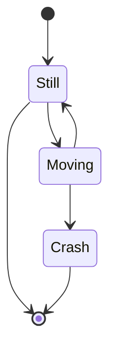

# NSCSCC2022 LoongArch挑战赛

中国科学技术大学 小步快跑队 2022年8月

## 成员

乐亦康、张子辰、郭耸霄、马子睿

## 设计简介

我们设计的CPU采用顺序双发射七级流水，实现了58条指令、26种CSR寄存器、16种例外。采用AXI接口与总线交互。使用4路组相联16KBicache和4路组相联16KBdcache，采用写回、按写分配的设计。使用分支预测器以减少分支失败带来的性能损失。

## 流水线功能设计

CPU 采用顺序双发射八级流水结构，流水线分为 IF0、IF1、FIFO、ID、REG、EXE0、EXE1、WB 八级。区别于传统的五级流水线结构，我们的设计将取指和访存都划分为两级流水，可以获得更高主频。区别于进阶版的七级流水，我们的设计将访存单元嵌入执行单元的一路中，有利于双发射的实现，以及向乱序的转变。

## 流水级级间设计

## 访存子系统设计

## 操作系统与应用

本 CPU 成功启动了 Linux 操作系统，在其上运行了性能测试，记录最终性能得分如下：

|    Benchmarks     |  Ref.   | Run Time |    Ratio    |
| :---------------: | :-----: | :------: | :---------: |
|   A0_1-limits01   | 43.5077 | 8.59177  |   5.06388   |
|   A1_1-large03    | 62.2865 | 29.5317  |   2.10914   |
|   B0_10-test19    | 508.288 | 93.0654  |   5.46162   |
|   B2_50-test19    | 333.118 | 82.8083  |   4.02276   |
|   B3_50-test19    | 279.832 | 83.2205  |   3.36254   |
|   B5_500-test19   | 554.867 |  156.22  |   3.55183   |
|   D0_100-test07   | 286.818 | 95.9582  |   2.98899   |
|  D0_1000-test10   | 553.577 | 246.948  |   2.24167   |
|  D0_1000-test06   | 119.142 | 123.142  |  0.967517   |
|    F0_1-test8     | 47.4547 | 11.4117  |   4.15843   |
|   G0_10-test03    | 898.276 | 187.288  |   4.79623   |
|   G0_10-test06    | 587.155 | 136.769  |   4.29304   |
|   H0_40-test03    | 349.407 | 84.2216  |   4.14866   |
|    I2_10-test1    | 167.637 | 26.3194  |   6.36932   |
|    coremark-0     | 177.385 | 21.3837  |   8.29535   |
|    coremark-1     | 177.932 | 21.4363  |   8.30049   |
| dhrystone-5000000 | 197.368 | 197.368  |   4.9836    |
|      geomean      |         |          | **3.95387** |

## 总结与展望

