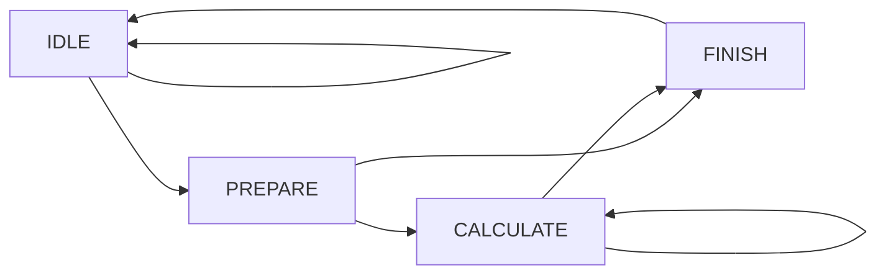
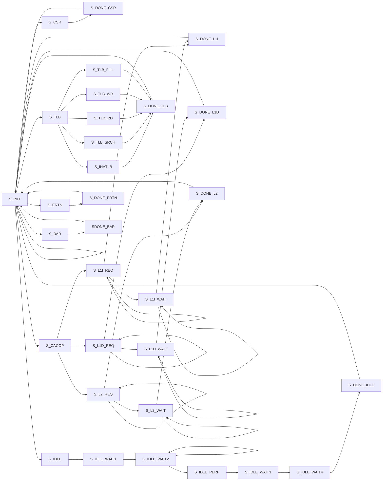

[TOC]

# NSCSCC2022 LoongArch挑战赛

中国科学技术大学 小步快跑队 2022年8月

## 成员

乐亦康、张子辰、郭耸霄、马子睿


## 设计简介

我们设计的CPU采用顺序双发射七级流水，实现了58条指令、26种CSR寄存器、16种例外。采用AXI接口与总线交互。使用4路组相联16KBicache和4路组相联16KBdcache，采用写回、按写分配的设计。使用分支预测器以减少分支失败带来的性能损失。

## 流水线功能设计

CPU 采用顺序双发射八级流水结构，流水线分为 IF0、IF1、FIFO、ID、REG、EXE0、EXE1、WB 八级。区别于传统的五级流水线结构，我们的设计将取指和访存都划分为两级流水，可以获得更高主频。区别于进阶版的七级流水，我们的设计将访存单元嵌入执行单元的一路中，有利于双发射的实现，以及向乱序的转变。


## 流水级级间设计

## 执行单元设计

执行单元采用双发射形式，一路为全能单元，可以执行全部指令，在指令到达时将其根据指令类别放入ALU0，BR，DIV，PRIV，MUL，dcache 六个执行路径之一。另一路仅可执行 ALU 指令。

### ALU

ALU 单元可以执行 ADD.W、SUB.W、SLT、SLTU、AND、OR、NOR、XOR、SLL.W、SRL.W、SRA.W 共11种运算。在得到运算结果后，向后空流水一级，以便与两级流水的运算单元补齐。

### BR

BR 单元可以执行 JIRL、B、BL、BEQ、BNE、BLT、BGE、BLTU、BGEU 共 9 种分支指令，在得到分支方向后，与从分支预测器经过流水级传递的信息进行比较，认可或纠正分支，并向分支预测器进行反馈。得到的分支结果寄存一级后再使用，以缩短关键路径。

### DIV

DIV 单元可以执行 DIV.W、MOD.W、DIV.WU、MOD.WU 共 4 种除法指令。采用提前开始方式，使用状态机控制，达到了不定长周期的效果。当进行除法时，将流水线阻塞。状态机如下：



### PRIV

PRIV 单元执行特权指令，采用状态机控制。在准备执行特权指令前，等待直到流水线中没有其他指令执行；当执行指令时，阻塞流水线，并在执行结束后 flush 一次前面的流水级，以确保稳定性。状态机如下：




### MUL

MUL 单元采用两级流水模式，第一级进行 16 位数的分组相乘，第二级将分组相乘的结果合理相加。这样做的目的是充分利用板上的 DSP 元件，达到比用通用电路实现的 Booth 编码 + 矩阵转置 + Wallace 树更好的时序。其数学原理如下：
$$
(2^{16}a+b)(2^{16}c+d)=2^{32}ac+2^{16}(bc+ad)+bd.
$$

## 高速缓存设计

### 设计综述

流水线CPU通过指令高速缓存、数据高速缓存使用AXI总线协议与主存进行数据交换，以求获得更小的访存成本。

当CPU需要内存访问时，流水线会向Cache发起访存请求。如果请求的地址数据在Cache中，则Cache将在下个时钟周期内送出访问数据；如果请求的地址数据不在Cache中，则Cache进入缺失状态，将由Cache向主存发起访存请求，待请求的数据返回后再将数据返回流水线。

Cache还需要处理流水线的uncache访存请求，在这里我们复用了一致可缓存地址部分的数据通路，使得强序非缓存的实现并没有无谓浪费更多的资源。具体实现方法为：对uncache的请求，强制令其Cache Miss，并调整访存的数据长度、大小，来做到精准访问一些外设对内存地址映射的地址空间。

Cache均采用**两拍式流水线**进行内存访问，保证了连续Cache访问命中时可以无需阻塞流水线，只需两拍顺序将地址送入cache即可。同时，ICache和DCache均采用**写回写分配**策略，能够大幅度提升访存密集型程序的运行效率。

在Loongarch架构中，需要使用CACOP指令来维护Cache和主存之间的一致性。对于这类指令，我们依然将其视作访存指令进行处理，并复用了基本的数据通路。为优化逻辑，我们也加入了新的状态来专门处理CACOP指令。

### 指令高速缓存（ICache）

* 基本参数：

  * 数据总大小：16KB

  * 路数：4路组相连
  * 单路行数：64行
  * 单行大小：64字节
  * 换行算法：LRU算法
  * 为契合流水线的双发射，ICache一次将给出2个字的数据

* 控制状态逻辑：

  | 状态        | 功能                                     |
  | ----------- | ---------------------------------------- |
  | IDLE        | 当前周期没有存储访问请求                 |
  | LOOKUP      | 收到流水线的一个取指请求，并判断是否MISS |
  | REPLACE     | 向主存发起读地址请求                     |
  | REFILL      | 收到读请求就绪信号，开始逐个接收返回数据 |
  | EXTRA_READY | 缺失状态返回数据全部结束                 |
  | CACOP_COPE  | 处理CACOP指令                            |

  ```mermaid
  graph LR
  A(IDLE)-->B(LOOKUP)-->C(REPLACE)-->D(REFILL)-->E(EXTRA_READY)-->A
  E-->B
  B-->B
  B-->A
  A-->F(CACOP_COPE)-->E
  B-->F
  ```

  取指流程如下：

  * Cache最初处在IDLE状态，收到取指请求时，只要当前取指请求不带异常，就进入LOOKUP状态
  * 进入LOOKUP状态时，四路数据和TAG都已经被读出，这时结合TLB给出的实地址，判断命中情况：
    * 如果命中，则需要判断此时流水线有没有发来新的取指请求：如果有，则继续进入LOOKUP状态，处理新的取指；如果没有，返回IDLE状态
    * 如果缺失，则进入REPLACE状态，向AXI总线发起读请求
    * 如果是uncache请求，则直接进入REPLACE状态
  * 当收到读请求就绪信号后，开始使用返回移位缓存区接收返回数据。待所有数据全部返回并拼接好后，将所需的2个字的数据返回给流水线，并将一行的数据写入ICache存储中

  **EXTRA_READY状态的设计，是为了当REFILL最后一拍将数据写回Cache存储器后，能够再多阻塞一个周期，避免后续继续访存的写优先问题，改善时序**

* LRU换行算法：

  Cache的LRU换行算法使用一个8bit的移位寄存器来完成。**Cache将“00”、“01”、“10”、“11”四个标识路号的二进制位按照一定顺序存入这个移位寄存器**，寄存器的[7:6]位标识了当前需要替换的路号。

  **当对某路进行访问后，硬件自动将这一路的路号放到寄存器低位，并将其他路号顺序向高位移动进行补位。**这种算法保证了当前最高两位标识的路号一定是最不常使用的路号，所以实现了LRU算法。

### 数据高速缓存（DCache）

* 基本参数：

  * 数据总大小：16KB
  * 路数：4路组相连
  * 单路行数：64行
  * 单行大小：64字节
  * 换行算法：LRU算法

* 控制状态逻辑：

  DCache状态机分为主状态机和写回状态机，其中主状态机与ICache类似，而写回状态机则负责处理向AXI总线写回的操作，使得能够将读写并行进行，提升缺失处理的效率

  主状态机的状态如下：

  | 状态        | 功能                                                         |
  | ----------- | ------------------------------------------------------------ |
  | IDLE        | 当前周期没有存储访问请求                                     |
  | LOOKUP      | 收到流水线的一个取指请求，并判断是否MISS                     |
  | MISS        | 向主存发起写地址请求                                         |
  | REPLACE     | 收到写请求就绪信号，向主存发起读地址请求                     |
  | REFILL      | 收到读请求就绪信号，开始逐个接收返回数据                     |
  | WAIT_WRITE  | 等待写回状态机将所有待写数据全部写回，写完成后将写回状态机复位 |
  | EXTRA_READY | 缺失状态返回数据全部结束                                     |
  | CACOP_COPE  | 处理CACOP指令                                                |

  ```mermaid
  graph LR
  A(IDLE)-->B(LOOKUP)-->G(MISS)-->C(REPLACE)-->D(REFILL)-->H(WAIT_WRITE)-->E(EXTRA_READY)-->A
  B-->B
  E-->B
  B-->A
  A-->F(CACOP_COPE)-->E
  B-->F
  F-->G
  G-->H
  ```

  

  写回状态机的状态如下：

  | 状态        | 功能                                               |
  | ----------- | -------------------------------------------------- |
  | IDLE        | 当前周期主状态机不需要向主存写回数据               |
  | REQUEST     | 向主存发起写数据请求，逐个将数据写回               |
  | WAIT_FINISH | 等待AXI总线写完成信号到来，并发出写完成就绪信号    |
  | FINISH      | 通知主状态机写操作完成，需要主状态机复位为IDLE状态 |

  ```mermaid
  graph LR
  A(IDLE)-->B(REQUEST)-->C(WAIT_FINISH)-->D(FINISH)-->A
  B-->B
  ```

  访存流程如下：

  * Cache最初处在IDLE状态，收到访存请求时，只要当前访存请求不带异常，就进入LOOKUP状态
  * 进入LOOKUP状态时，四路数据和TAG都已经被读出，这时结合TLB给出的实地址，判断命中情况：
    * 如果命中，则需要判断此时流水线有没有发来新的取指请求：如果有，则继续进入LOOKUP状态，处理新的取指；如果没有，返回IDLE状态
    * 如果缺失，则当需要替换的一路有脏数据时，进入MISS状态；当需要替换一路不脏时，进入REPLACE状态
    * 如果是uncache请求，则当访存请求为写时，进入MISS状态；当访存请求为读时，进入REPLACE状态
  * 若需要写回数据，则在此时启动写回状态机，开始将数据逐个写回主存。同时，主状态机发起读请求，并按照和ICache相同的策略接收返回数据
  * 考虑到虽然写请求一定先发出，但读操作可能比写操作先完成的情况，主状态机将在WAIT_WRITE状态等待。当写回状态机进入FINISH状态后，主状态机将结束此次访存，同时将写回状态机复位。

  对于ICache，CACOP的处理只需要将对应Cache行的TagV表无效化即可。但对于DCache，由于CACOP涉及写回操作，故在此有必要进一步说明：

  * 当CACOP请求被DCache接收后，需要判读操作的行是否脏。如果不脏，那么只需无效化对应行的TagV表即可。如果脏，则需要向AXI总线发起写回请求
  * **CACOP的写回依然复用了主状态机的MISS状态**，只是这时写回之后直接跳入WAIT_WRITE状态，等待写回完毕

  * CACOP的处理需要复用原有数据通路，因此需要对缺失选路逻辑作如下修改：
    * **当操作为INDEX_INVALIDATE时，以地址的最后两位选择路号**
    * **当操作为HIT_INVALIDATE时，以hit信号作为选择路号**

* 原子访存的处理

  DCache可以对原子访存进行处理。对于ll.w指令，DCache会视为一条ld指令，但同时会将llbit置位。对于sc.w指令，DCache会首先检查llbit是否置位，如果置位则清除之，并视为一条st指令，并向流水线返回访存成功信息；如果未置位，则立刻强制完成（也即跳过）这条指令，并向流水线返回访存失败信息。更应当注意的是，**无效的sc.w不应触发任何例外。**

## TLB设计

### 结构设计

在Loongarch架构中，TLB是用以加速地址转换的重要单元。TLB的地址转换非常多样，有直接映射窗口DMW的虚实地址转换、直接翻译模式的地址转换和页表模式下的地址转换。TLB将以上三种转换模式合并起来，组成了统一的地址转换TLB单元。

* 路数：32路全相连
* 对外接口：
  * ICache查询接口
  * DCache查询接口
  * TLBRD指令读接口
  * TLBFILL和TLBWR指令写接口
  * TLBSRCH指令查询接口
  * INVTLB无效化接口
* 结构单元：
  * 比较命中单元
  * 地址转换单元
  * 页表存储单元
  * 例外生成单元
  * 中间段寄存器

### 时序改善

在TLB的设计中，我们加入了**中间段寄存器**，这个寄存器将会把命中信息锁存下来，供之后的地址转换单元和例外生成单元使用。这样可以在**不改变exe段设计的情况下，最大程度改善时序。**

### TLB的例外信息处理

TLB生成的所有例外信息，将会全部送往对应的Cache，在Cache中结合Cache生成的例外信息，进行优先级比较，之后由Cache统一送回流水线。这样可以使得流水线减少一个例外接口，简化了例外处理的设计。

## 操作系统与应用

我们在启动 PMON 时，发现了 chiplab 平台给出的 PMON 的一处操作与《龙芯架构32位精简版参考手册》v1.02相违背，便在 Gitee 平台 chiplab 仓库提出了 issue [#I5L39E](https://gitee.com/loongson-edu/chiplab/issues/I5L39E) ，为大赛的后续组织作出了贡献。

本 CPU 成功启动了 Linux 操作系统，在其上运行了性能测试，记录最终性能得分如下：

|    Benchmarks     |  Ref.   | Run Time |    Ratio    |
| :---------------: | :-----: | :------: | :---------: |
|   A0_1-limits01   | 43.5077 | 8.59177  |   5.06388   |
|   A1_1-large03    | 62.2865 | 29.5317  |   2.10914   |
|   B0_10-test19    | 508.288 | 93.0654  |   5.46162   |
|   B2_50-test19    | 333.118 | 82.8083  |   4.02276   |
|   B3_50-test19    | 279.832 | 83.2205  |   3.36254   |
|   B5_500-test19   | 554.867 |  156.22  |   3.55183   |
|   D0_100-test07   | 286.818 | 95.9582  |   2.98899   |
|  D0_1000-test10   | 553.577 | 246.948  |   2.24167   |
|  D0_1000-test06   | 119.142 | 123.142  |  0.967517   |
|    F0_1-test8     | 47.4547 | 11.4117  |   4.15843   |
|   G0_10-test03    | 898.276 | 187.288  |   4.79623   |
|   G0_10-test06    | 587.155 | 136.769  |   4.29304   |
|   H0_40-test03    | 349.407 | 84.2216  |   4.14866   |
|    I2_10-test1    | 167.637 | 26.3194  |   6.36932   |
|    coremark-0     | 177.385 | 21.3837  |   8.29535   |
|    coremark-1     | 177.932 | 21.4363  |   8.30049   |
| dhrystone-5000000 | 197.368 | 197.368  |   4.9836    |
|      geomean      |         |          | **3.95387** |

我们在 Linux 上成功运行了一个 C 语言解释器，下面是通过串口输出的截图：


## 总结与展望

